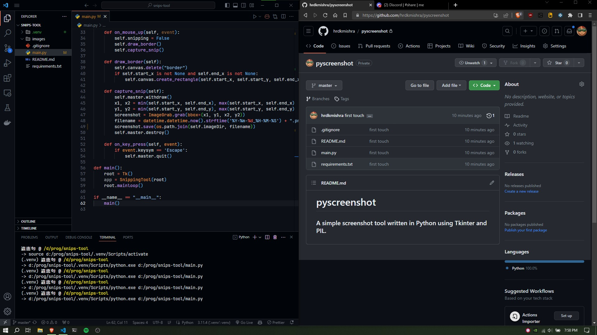
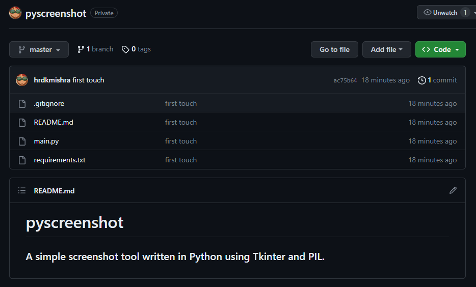

# pyscreenshot

### A simple screenshot tool written in Python using Tkinter and PIL.

## How does it look?

>I screenshotted my screenshot to!? *Ironic*.

## Result

## Customization

* maybe you want to change the directory?

    `self.imageDir = "./images"  # add your preferred directory here`

* maybe you want to change the file type?
    
    `self.imageType = ".png"  # add your preferred file type here`
